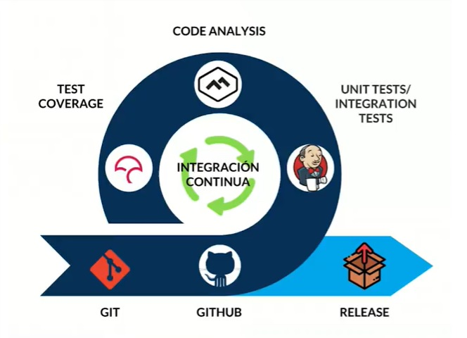
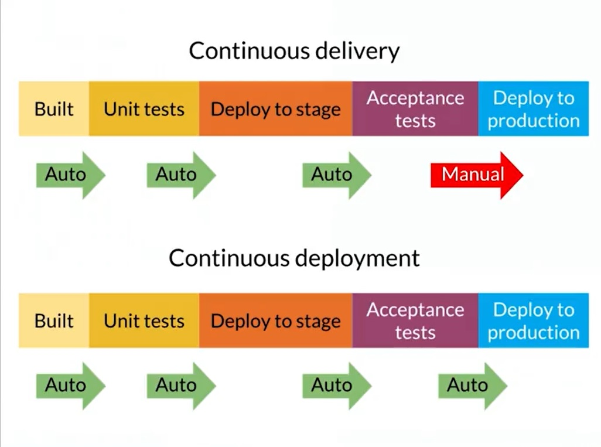

# DevOps Course

##### Table of contents
* [Introduction](#introduction) 
* [Technologies](#technologies)
* [Commands](#commands)
* [Syntax](#syntax)
* [Illustrations](#illustrations)

## Introduction
In this course we learned that DevOps is a set of practices that combines software development (Dev) and IT operations (Ops). It aims to shorten the systems development life cycle and provide continuous delivery with high software quality.

****************************************************

## Technologies
* Docker
* Jenkins

****************************************************

## Commands:
##### Docker

| Command | Functionality                    |
| ------------- | ------------------------------ |
| `builder`      | Manage builds.       |
| `service`   |  Manage services.    | 
| `config`   | Manage Docker configs.    | 
| `context`   |  	Manage contexts.     | 
| `engine`   |  	Manage the docker Engine.     | 
| `image`   |  	Manage images.     | 
| `network`   |  	Manage networks.     | 
| `node`   |  	Manage Swarm nodes.     | 
| `plugin`   |  	Manage plugins.     | 
| `secret`   |  	Manage Docker secrets.     | 

****************************************************

## Syntax
#### Deploy
###### Execute Shell - Command Example
```
echo "FROM $ARTIFACT_ID" > Dockerfile
RESULT_URL=$(now -t $NOW_TOKEN)

# Acceptance test
curl $RESULT_URL/add/3/4 | grep 7

```

****************************************************


## Illustrations
##### Continuous Integration


****************************************************

##### Continuous delivery vs Continuous deployment


****************************************************
